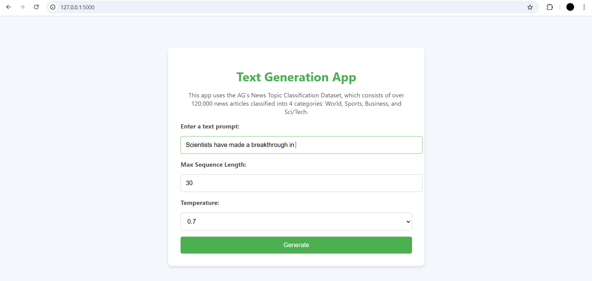
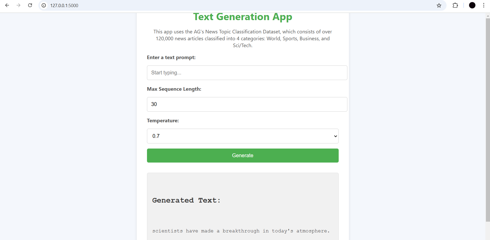

# Text Generation App

A simple web application that utilizes a pre-trained text generation model to generate news-related text based on user input. The model predicts the continuation of a given text prompt and generates content related to news topics, such as Business, Sports, Sci/Tech, and World news.

## Features

- **Text Generation**: Generate text based on a prompt related to news topics like Business, Sports, Sci/Tech, and World news.
- **Temperature Control**: Adjust the temperature of the model to control the creativity and randomness of the generated text.
- **Max Sequence Length**: Set the maximum length for the generated text.

## Screenshot

> The above screenshot demonstrates the functionality of the web app where users can input a prompt and receive generated text based on the model's predictions.

## Dataset

This app uses the **AG's News Topic Classification Dataset**, which contains news articles categorized into 4 topics:

1. **World**
2. **Sports**
3. **Business**
4. **Sci/Tech**

The dataset contains a large number of news articles and is commonly used for text classification tasks.

For more details on the dataset, please refer to the [AG's News dataset page](http://www.di.unipi.it/~gulli/AG_corpus_of_news_articles.html).

The dataset for this project is sourced from a reputable repository, [AG's News dataset](http://www.di.unipi.it/~gulli/AG_corpus_of_news_articles.html), which provides text-rich data ideal for language modeling. The dataset was preprocessed to extract articles related to the four chosen categories: World, Sports, Business, and Sci/Tech. 

## Model Details

The text generation model used in this app is based on a **Long Short-Term Memory (LSTM)** network, a type of recurrent neural network (RNN). LSTM models are well-suited for sequence prediction tasks, like text generation, because they are capable of learning and remembering long-term dependencies in sequential data.

#### Data Preprocessing

- The dataset was cleaned and tokenized into words. Special characters, stopwords, and irrelevant symbols were removed to ensure that the model could learn from the core textual data.
- Text was then padded to ensure a uniform sequence length across all input samples.
  
#### Model Architecture and Training Process

- **Architecture**: The model consists of an embedding layer to convert words into dense vectors, followed by one or more LSTM layers to process sequential dependencies, and a dense output layer to predict the next word in the sequence.
- **Training**: The model was trained using a language modeling objective, where it was provided with a sequence of words and tasked with predicting the next word in the sequence.
- **Optimization**: The model was optimized using the Adam optimizer and a categorical cross-entropy loss function to minimize prediction errors.

#### Web App Interface

The web application allows users to input a text prompt, and the model generates a continuation of the text. It features:
- **Text input field**: Users can type a prompt (e.g., "Business in today's world").
- **Temperature control**: Users can adjust the temperature, which controls the randomness of the text generation.
- **Max sequence length**: Users can set the maximum length for the generated text.

When users enter a prompt, the app uses the trained LSTM model to predict and display the next part of the sequence, continuing the input text in a coherent manner.

### Application Deployment

This web application was developed using **Flask**, which interfaces with the pre-trained LSTM model to handle text generation requests. The front end is designed with HTML, CSS, and JavaScript to create an interactive interface.

For deployment, Flask runs the model on a backend server, processes the input, and returns the generated text, which is displayed on the same page.

---
