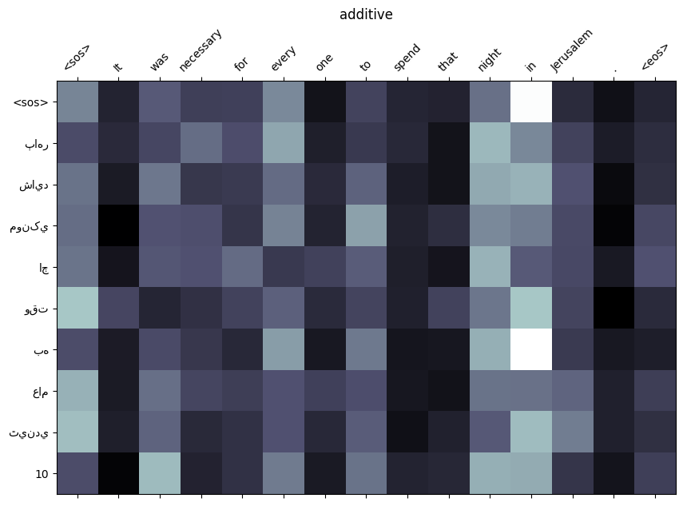
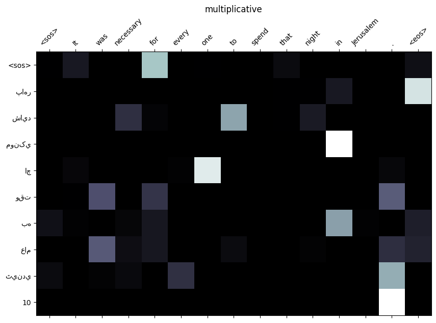
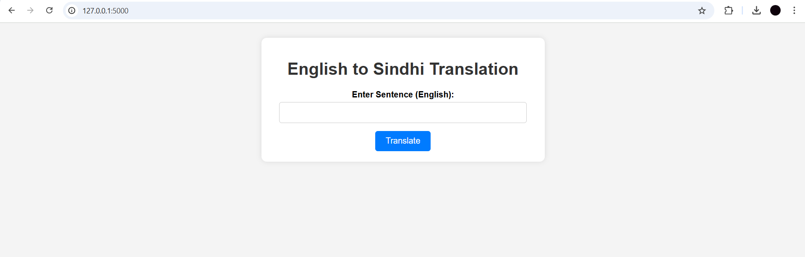
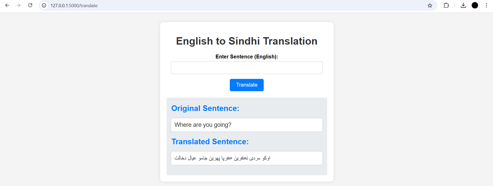

# English-to-Sindhi Translation Web Application

## Overview
This project is a web application designed for English-to-Sindhi translation using transformer-based models. The application includes dataset preprocessing, training with sequence-to-sequence (Seq2Seq) models, and attention mechanisms to improve translation accuracy.

## Dataset
The project utilizes the **NLLB.en-sd.en** dataset from the **No Language Left Behind (NLLB)** initiative. This dataset contains parallel sentence pairs in English and Sindhi, aiding in training neural machine translation models.

### Dataset Processing
- **Alignment Filtering:** Sentence pairs are filtered based on alignment scores using a dynamic threshold.
- **Dynamic Thresholding:**
  - The **95th percentile** of alignment scores is used to determine the threshold dynamically.
  - Only the **top 5%** of sentence pairs with the highest alignment scores are retained.
- **Filtering Approach:**
  - Sentences with scores above the calculated threshold are included in training.
  - This ensures that only the most relevant and well-aligned translations are used for model training.

## Seq2Seq Model and Attention Mechanism
The core translation model follows a **Sequence-to-Sequence (Seq2Seq) architecture** with an attention mechanism to improve accuracy.

### Transformer Model
The Transformer model, a state-of-the-art neural network architecture for NLP tasks, is employed in this project. It consists of:
- **Encoder:** Processes the input sentence and generates a contextual representation.
- **Decoder:** Uses this representation to generate the output translation step by step.

### Attention Mechanisms
- **Additive Attention:** A mechanism where the attention score is computed using a learned additive function of the input and output states.
- **General Attention:** Similar to additive attention but uses a learned linear function (dot-product style) for computing attention scores.
- **Multi-Head Attention:** Uses multiple attention heads in parallel to attend to different parts of the input sequence, allowing the model to capture various relationships between the words.

## Evaluation and Verification
### Model Performance
### The Three Attention Mechanisms Compared

| Attention Variant  | Training Loss (Epoch 5) | Training PPL (Epoch 5) | Validation Loss (Epoch 5) | Validation PPL (Epoch 5) |
|--------------------|------------------------|-------------------------|--------------------------|--------------------------|
| **General**        | 2.817                  | 16.721                  | 1.943                    | 6.981                    |
| **Multiplicative** | 2.704                  | 14.942                  | 1.867                    | 6.468                    |
| **Additive**       | 2.757                  | 15.745                  | 1.913                    | 6.771                    |

## Attention Maps
Attention maps provide a visualization of how the model focuses on different parts of the input sequence during translation. These maps help in understanding the model's behavior and where the attention is distributed across the input sentence.

### Visualizations:
1. **Additive Attention Map:**
   - This map shows how the model allocates attention between input and output words using **Additive Attention**. It highlights the dependencies between words in the source and target languages.
   

2. **General Attention Map:**
   - This map visualizes how the model focuses on different parts of the input sentence using **General Attention**. It gives insight into the linear relationship between input and output words.
   

3. **Multi-Head Attention Map:**
   - This map illustrates how multiple attention heads focus on various aspects of the input sentence in parallel, improving the model’s translation accuracy.
   

## Web Application Screenshots
1. **App UI:**
   

2. **Translated Output:**
   

