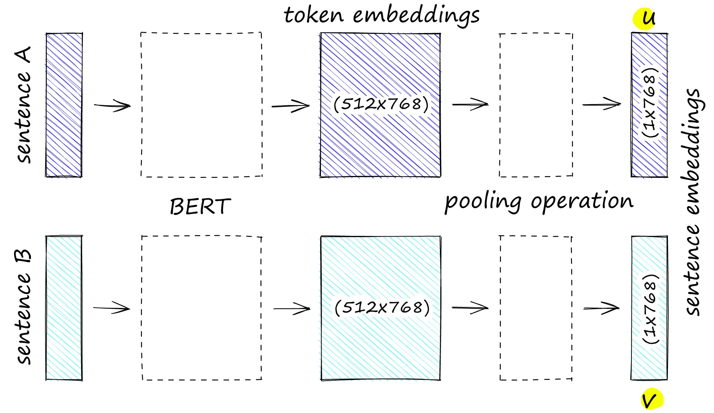
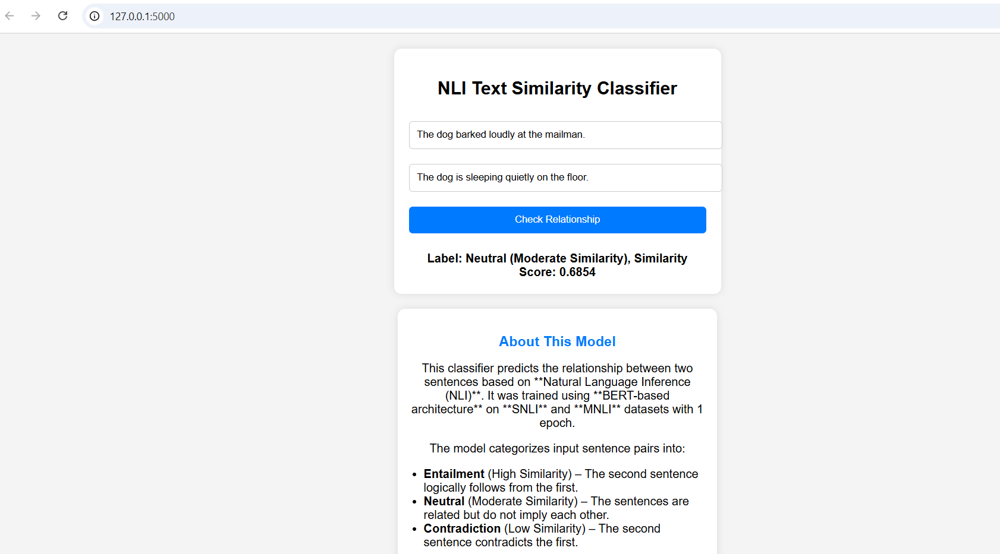
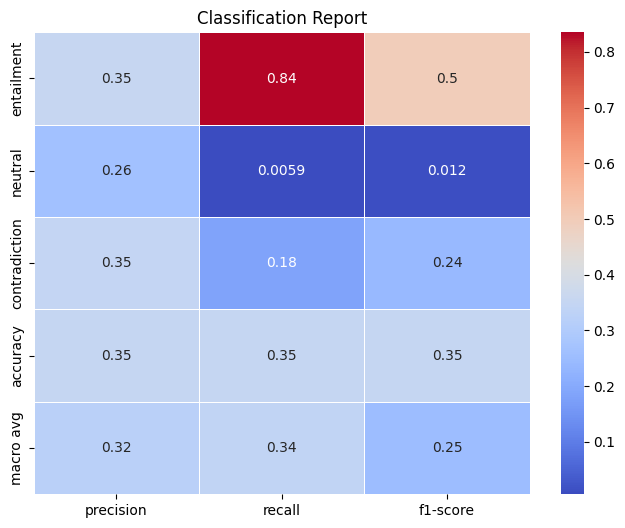

# NLI Text Similarity Classifier

## Overview

This project involves training a BERT-based model for the task of **Natural Language Inference (NLI)**, specifically to classify relationships between sentence pairs. The model was pre-trained on the **BookCorpus** dataset and fine-tuned on **SNLI** and **MNLI** datasets. The goal is to determine whether a pair of sentences is related in the following ways:

- **Entailment**: Sentence B logically follows from Sentence A.
- **Contradiction**: Sentence B contradicts Sentence A.
- **Neutral**: Sentence B is unrelated or doesn't contradict Sentence A.

## Table of Contents

- [Pre-training](#pre-training)
- [Fine-tuning](#fine-tuning)
- [Training Parameters](#training-parameters)
- [Model Architecture](#model-architecture)
- [Limitations and Improvements](#limitations-and-improvements)
- [Screenshots](#screenshots)

## Pre-training

### Dataset

- **Dataset**: BookCorpus
- **Source**: [Hugging Face Community Datasets](https://huggingface.co/datasets/bookcorpus) 
- **Description**: The BookCorpus dataset consists of text extracted from a large collection of books. It is diverse and suitable for learning general language patterns across multiple genres and topics.
- **Total Samples**: 1,000,000
- **Samples Used for Training**: 100,000
- **Columns Used**: Raw text from books (no predefined labels, just plain text).

| **Property**       | **Details**                   |
|-------------------|-------------------------------|
| Dataset Name      | BookCorpus                    |
| Text Used         | Raw text from books           |
| Total Samples    | 1,000,000                      |
| Samples for Training | 100,000                     |

### Training Parameters

| **Parameter**         | **Value**               |
|-----------------------|-------------------------|
| Max Sequence Length   | 1000 tokens             |
| Batch Size            | 6                       |
| Number of Epochs      | 1000                    |
| Final Training Loss   | 3.649                   |

### Model Architecture

- **Encoder Layers (n_layers)**: 6
- **Multi-Head Attention (n_heads)**: 8
- **Embedding Size (d_model)**: 768
- **Feedforward Dimension (d_ff)**: 3072
- **Key/Value Dimension (d_k, d_v)**: 64
- **Number of Segments (n_segments)**: 2

### Siamese Network Structure  

Below is the **Siamese Network Architecture** used for training sentence embeddings:  

  
*Figure 1: Siamese Network Architecture for Sentence Transformers (Image Credit: [Pinecone](https://www.pinecone.io/learn/series/nlp/train-sentence-transformers-softmax/))*  

#### Challenges

- **GPU Memory Constraints**: The batch size was limited to 6 due to available GPU memory. Larger batch sizes could improve performance but may cause out-of-memory errors.
- **Overfitting Risk**: With 1000 epochs, the model may have overfitted, especially after a certain number of epochs. Early stopping or regularization techniques could help mitigate this.
- **Handling Long Sequences**: Though the sequence length was limited to 1000 tokens, this may still result in truncation of longer texts.

#### Proposed Improvements

- **Increase Batch Size**: If hardware allows, increasing the batch size could improve performance.
- **Regularization**: Apply dropout or weight decay to reduce overfitting.
- **Learning Rate Schedule**: Implement learning rate warm-ups and schedules for better convergence.

## Fine-tuning

### Datasets

- **SNLI** and **MNLI** (Merged for training)
- **Source**:  
  - SNLI: [Stanford NLP on Hugging Face](https://huggingface.co/datasets/snli)  
  - MNLI: [NYU Machine Learning for Language on Hugging Face](https://huggingface.co/datasets/mnli)  
- **Description**: Both SNLI and MNLI are widely used datasets for Natural Language Inference (NLI) tasks. They consist of sentence pairs and labels indicating the relationship (entailment, contradiction, neutral).

| **Dataset**       | **Samples Used for Training** | **Validation Samples** | **Test Samples** |
|-------------------|-------------------------------|------------------------|------------------|
| SNLI + MNLI (Merged) | 100,000                       | 10,000                 | 10,000           |

### Fine-tuning Parameters

| **Parameter**         | **Value**             |
|-----------------------|-----------------------|
| Max Sequence Length   | 128 tokens            |
| Batch Size            | 32                    |
| Number of Epochs      | 5                     |

#### Challenges

- **Memory Limitation**: The batch size was set to 32 to fit within GPU memory limits. Increasing the batch size might speed up training but may lead to memory issues.
- **Overfitting**: With a large number of epochs, the model may overfit on the training set. Monitoring validation loss would be key to prevent this.

#### Proposed Improvements

- **Cross-validation**: Implement cross-validation during fine-tuning to ensure better generalization.
- **Learning Rate Tuning**: Fine-tune the learning rate for better convergence.
- **Regularization**: Apply dropout during fine-tuning to reduce overfitting.

## Training Parameters Summary

| **Parameter**         | **Pre-training (BookCorpus)** | **Fine-tuning (SNLI & MNLI Merged)** |
|-----------------------|------------------------------|------------------------------|
| Max Sequence Length   | 1000 tokens                  | 128 tokens                   |
| Batch Size            | 6                            | 32                           |
| Epochs                | 1000                         | 5                            |
| Final Loss            | 3.649                        | -                            |

## Model Architecture Summary

| **Architecture Component** | **Value** |
|----------------------------|-----------|
| Encoder Layers (n_layers)  | 6         |
| Attention Heads (n_heads)  | 8         |
| Embedding Size (d_model)   | 768       |
| Feedforward Dimension (d_ff) | 3072    |
| Key/Value Dimensions (d_k, d_v) | 64   |
| Number of Segments (n_segments) | 2   |

## Limitations and Challenges

1. **GPU Memory Limitations**: The batch size was constrained by the available GPU memory, which affected training speed.
2. **Overfitting**: With 1000 epochs of pre-training and fine-tuning, there is a risk of overfitting. This could have been mitigated with regularization or early stopping.
3. **Long Sequence Handling**: Although the model can process sequences up to 1000 tokens, longer sequences may result in truncation, losing valuable information.

## Proposed Improvements

- **Hardware Upgrade**: Increasing the available GPU memory could allow for larger batch sizes and faster training.
- **Regularization**: Apply dropout or weight decay to prevent overfitting, especially during fine-tuning.
- **Learning Rate Tuning**: Implement a learning rate schedule to improve convergence during training.

## Screenshots

Here are some screenshots of the **NLI Text Similarity Classifier** in action:

### Model Interface

### Classification Report

---
## References
- **Siamese Network Image**: Adapted from [Pinecone NLP Guide](https://www.pinecone.io/learn/series/nlp/train-sentence-transformers-softmax/)  
- **BookCorpus Dataset**: [Hugging Face Community Datasets](https://huggingface.co/datasets/bookcorpus)  
- **SNLI Dataset**: [Stanford NLP on Hugging Face](https://huggingface.co/datasets/snli)  
- **MNLI Dataset**: [NYU Machine Learning for Language on Hugging Face](https://huggingface.co/datasets/mnli)  

