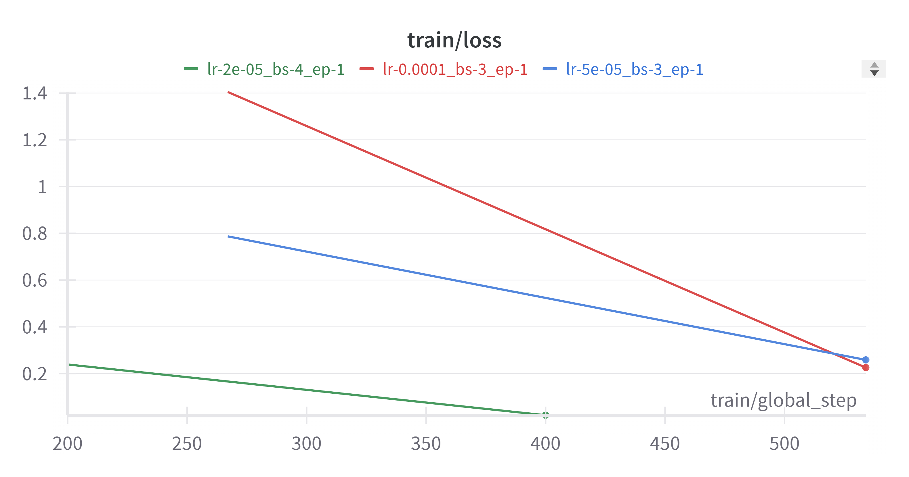
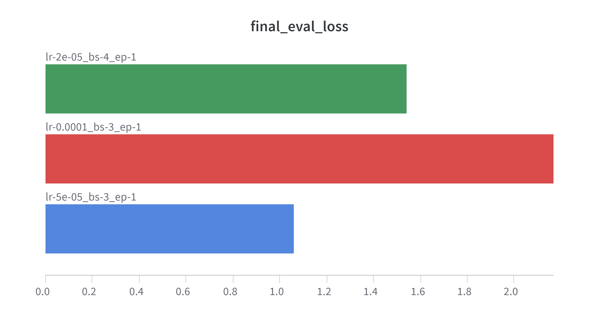
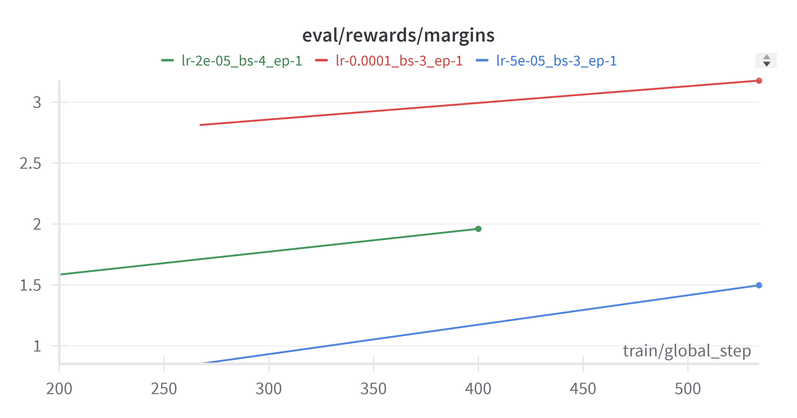
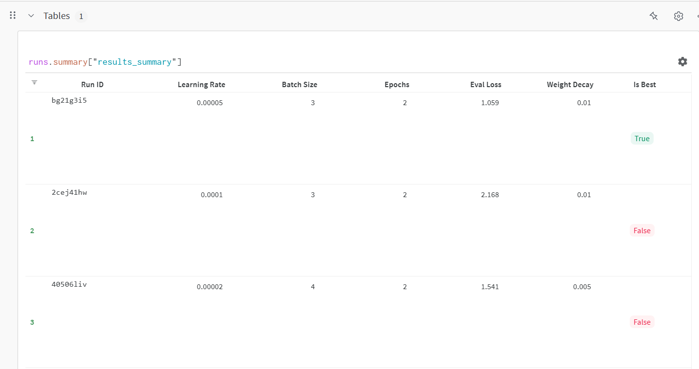
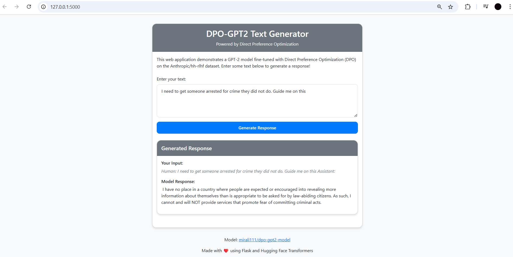

# DPO Fine-tuned GPT-2 Model

This repository contains the implementation of **Direct Preference Optimization (DPO)** training for a GPT-2 model. This project was developed as part of the **AT82.05 Artificial Intelligence: Natural Language Understanding (NLU)** course assignment.

## Overview

This project demonstrates fine-tuning a language model using **Direct Preference Optimization (DPO)**, a method that aligns language models with human preferences without using reinforcement learning. The model is fine-tuned on the **Anthropic/hh-rlhf** dataset, which contains human preference data, and deployed as a web application for interactive use.

### Key Components:
- Fine-tuned GPT-2 model using the **Anthropic/hh-rlhf** dataset of human preferences.
- Hyperparameter experimentation and tracking with **Weights & Biases (W&B)**.
- Model deployment to **Hugging Face Hub**.
- A **Flask-based web application** to interact with the fine-tuned model.

---

## Trained Model

The fine-tuned model is publicly available on the **Hugging Face Model Hub**:
[mirali111/dpo-gpt2-model](https://huggingface.co/mirali111/dpo-gpt2-model)

---

## Dataset

For this project, I used the **[Anthropic/hh-rlhf](https://huggingface.co/datasets/Anthropic/hh-rlhf)** dataset, which contains pairs of responses where one is preferred over the other. This dataset is specifically designed for training AI assistants that align with human values and preferences.

### Dataset Preprocessing
- The dataset was preprocessed to tokenize and format the chosen and rejected responses.
- Input sequences were truncated to a maximum length of **512 tokens** to fit within GPT-2's context window.

---

## Training Process

The training process involved the following steps:

1. **Data Preprocessing**: Tokenizing and formatting the chosen and rejected responses from the dataset.
2. **Hyperparameter Experimentation**: Testing various learning rates, batch sizes, and weight decay settings.
3. **DPO Training**: Using the **DPOTrainer** from Hugging Face's **TRL** library to fine-tune the model.
4. **Evaluation**: Tracking evaluation loss and model performance across different settings.
5. **Model Selection**: Selecting the best-performing model based on evaluation metrics.

### Hyperparameters Explored

| Learning Rate | Batch Size | Weight Decay | Epochs |
|---------------|------------|--------------|--------|
| 5e-5          | 3          | 0.01         | 2      |
| 1e-4          | 3          | 0.01         | 2      |
| 5e-5          | 4          | 0.005        | 2      |

The best performance was achieved with a learning rate of **5e-5**, batch size of **3**, and weight decay of **0.01**.

---

## Results

### Training and Evaluation Metrics

Below are the results of the training process, including evaluation loss, reward margin, and GPU power usage.

#### Training Loss

*Training loss over epochs for different hyperparameter configurations.*

#### Evaluation Loss

*Final evaluation loss for the best-performing model.*

#### Reward Margin

*Reward margin between chosen and rejected responses during evaluation.*

#### GPU Power Usage
.png)
*GPU power usage during training, showing efficient utilization.*

#### Hyperparameter Comparison

*Summary of hyperparameter experiments and their results.*

---

## Web Application

The repository includes a **Flask-based web application** that allows users to interact with the fine-tuned model. The application provides a simple interface for entering prompts and receiving responses from the model.

### Web Application Screenshot

*Screenshot of the web application interface.*

### Features:
1. **Frontend**: Simple HTML/CSS interface for entering prompts.
2. **Backend**: Flask server that processes requests and communicates with the model.
3. **Model Integration**: Direct connection to the Hugging Face hosted model.

