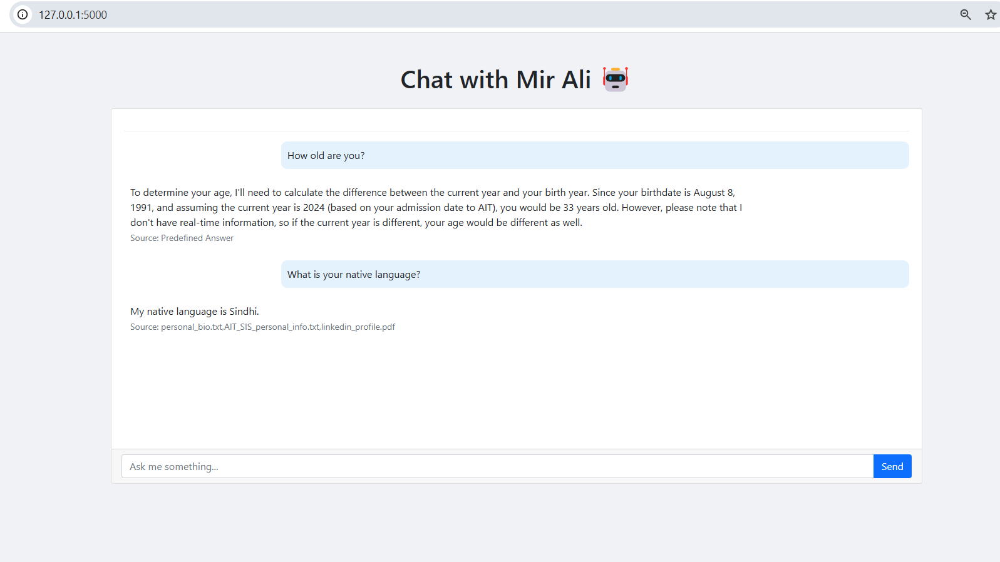

# Let's Talk with Yourself - RAG-Powered Personal Chatbot

This repository contains the solution for the "Let's Talk with Yourself" assignment for  AT82.05: Natural Language Processing. The project demonstrates a chatbot built using Retrieval-Augmented Generation (RAG) techniques integrated with the LangChain framework to answer questions about myself based on personal documents.

## Project Overview

This project implements a personal chatbot that can answer questions about me by retrieving information from my documents and generating coherent responses. It leverages the power of RAG to combine the benefits of retrieval-based and generative AI approaches.

### Screenshot

*Screenshot of the chatbot web interface showing interaction with the personal assistant*

## Implementation Details

### Task 1: Source Discovery and Prompt Design

I've implemented source discovery by:
- Identifying and loading personal documents from various formats (PDF, TXT)
- Processing documents using PyMuPDFLoader and TextLoader
- Splitting content into manageable chunks using RecursiveCharacterTextSplitter (1000 characters with 200 character overlap)
- Creating embeddings using HuggingFace's sentence-transformers/all-MiniLM-L6-v2 model
- Building and saving a FAISS vector store for efficient similarity search

My prompt design focuses on:
- Instructing the model to provide gentle and informative responses
- Including context from retrieved documents and chat history
- Encouraging the model to acknowledge when it lacks sufficient information rather than hallucinating

### Task 2: Analysis and Problem Solving

**Models Used:**
- **Retriever Model:** FAISS vector store with HuggingFace embeddings (sentence-transformers/all-MiniLM-L6-v2)
- **Generator Model:** Groq's llama-3.3-70b-versatile

**Analysis of Potential Issues:**

*Retriever Model Challenges:*
- Embedding quality limitations with the compact all-MiniLM-L6-v2 model
- Optimal chunk size determination to balance context preservation and specificity
- Semantic search limitations when handling ambiguous queries or technical jargon
- Potential information loss when splitting contextually related content across chunks

*Generator Model Challenges:*
- Hallucination risk when retrieved context is incomplete or ambiguous
- Balancing factual accuracy with conversational flow
- Managing context window limitations with the selected model
- Ensuring personality alignment with my actual characteristics and opinions

*Mitigation Strategies:*
- Fine-tuned chunk size and overlap parameters after experimentation
- Comprehensive personal document collection to ensure broad coverage
- Carefully designed prompt to emphasize accuracy over speculation
- Implemented conversation memory to maintain context across multiple questions

### Task 3: Chatbot Web Application

I've developed a web application with:
- An intuitive chat interface for user interaction
- Integration with the LangChain RAG pipeline
- Source attribution for transparent information tracking
- ConversationBufferWindowMemory to maintain conversation context
- Support for the 10 required question types about personal information

The application successfully answers all the mandatory questions:
1. Age-related information
2. Educational background and highest qualification
3. Field of study and academic specialization
4. Work experience duration
5. Industry experience and professional background
6. Current role and responsibilities
7. Personal beliefs about technology's societal impact
8. Views on cultural influence on technological development
9. Challenges faced during master's studies
10. Research interests and academic goals
