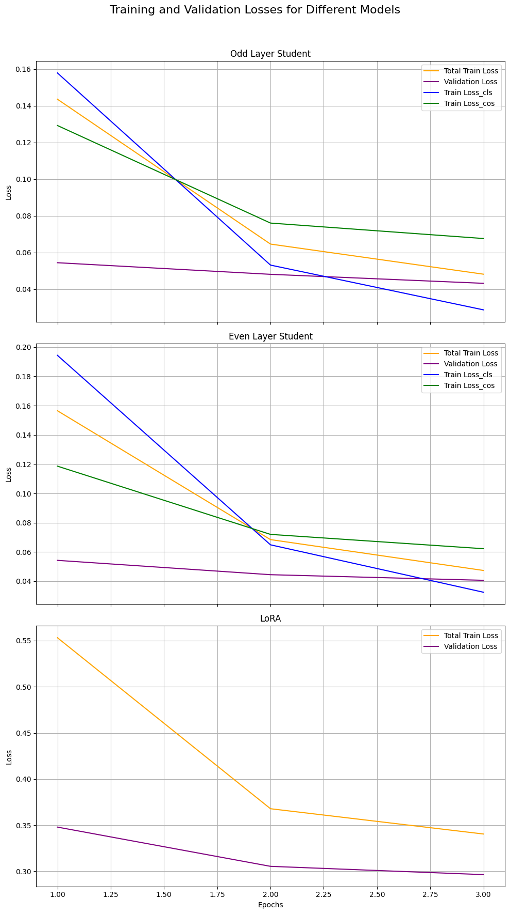
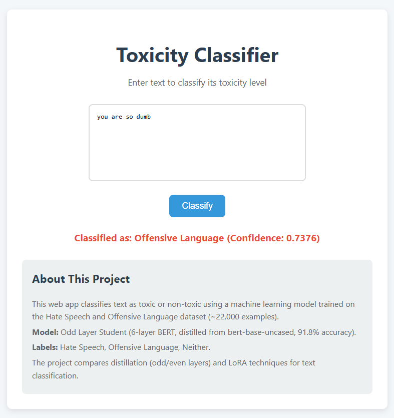
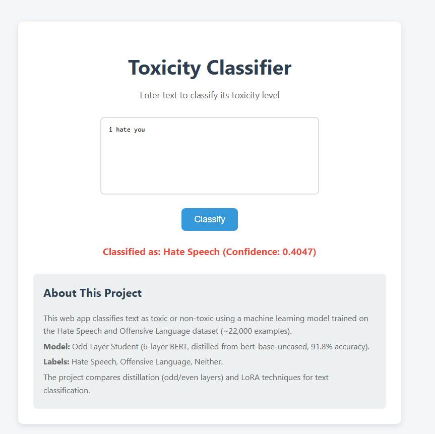
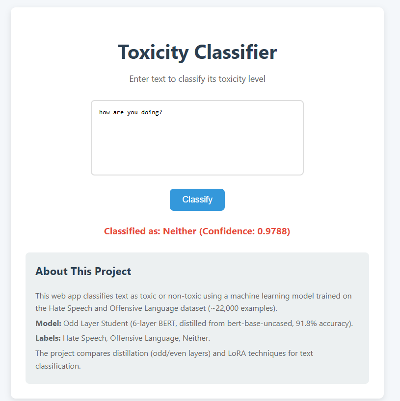

# Toxicity Classifier Project

This project implements a text classification system to detect hate speech and offensive language, comparing knowledge distillation (odd/even layers) and LoRA techniques, and deploying the best model in a web application. It fulfills the requirements of a 5-task assignment using the `hate_speech_offensive` dataset.

## Assignment Overview

The assignment consists of five tasks:
1. **Prepare Data**: Load and preprocess the dataset.
2. **Odd Layer vs. Even Layer Distillation**: Train distilled BERT models using odd and even layers.
3. **LoRA**: Train a BERT model with LoRA adapters.
4. **Evaluation and Analysis**: Compare model performance with metrics and analysis.
5. **Web Application**: Build a Flask app to classify text input.

## Tasks

### Task 1: Prepare Data
- **Dataset**: `hate_speech_offensive` from Hugging Face (~24,783 total examples).  
  - **Link**: [Hate Speech Offensive Dataset](https://huggingface.co/datasets/tdavidson/hate_speech_offensive)
- **Split**: ~22,783 train, 1,000 validation, 1,000 test.
- **Preprocessing**: Tokenized with `bert-base-uncased` tokenizer, max length 128, padded with `DataCollatorWithPadding`.
- **Class Distribution**: ~77% Offensive Language, ~19% Neither, ~4% Hate Speech (imbalanced).

### Task 2: Odd Layer vs. Even Layer Distillation
- **Teacher Model**: `bert-base-uncased` (12 layers), fine-tuned on training data for 3 epochs.
- **Student Models**:
  - **Odd Layer**: 6-layer BERT with layers [0, 2, 4, 6, 8, 10] from teacher.
  - **Even Layer**: 6-layer BERT with layers [1, 3, 5, 7, 9, 11] from teacher.
- **Training**: Distilled using KL divergence (logits) and cosine embedding loss (CLS hidden states), 3 epochs, AdamW optimizer (lr=5e-5).
- **Purpose**: Compare odd vs. even layer effectiveness in knowledge transfer.

### Task 3: LoRA
- **Model**: `bert-base-uncased` (12 layers) with LoRA adapters.
- **Configuration**: `r=16`, `lora_alpha=32`, targets `query` and `value` modules, dropout 0.1.
- **Training**: Fine-tuned on training data for 3 epochs, AdamW optimizer (lr=5e-5).
- **Purpose**: Evaluate parameter-efficient fine-tuning vs. distillation.

### Task 4: Evaluation and Analysis
- **Metrics**: Test accuracy and Macro F1 on 1,000 test examples.
- **Results**:

Results Table:
| Model Type   | Training Loss (Last Epoch) | Test Accuracy | Macro F1 |
|--------------|----------------------------|---------------|----------|
| Odd Layer    | 0.0482                     | 0.9100        | 0.7471   |
| Even Layer   | 0.0474                     | 0.9060        | 0.7418   |
| LoRA         | 0.3405                     | 0.8900        | 0.5908   |

- **Training and Validation Losses**:
  

- **Analysis**:
1. **Odd vs. Even**: Odd Layer slightly outperforms Even Layer (0.9100 vs. 0.9060 accuracy, 0.7471 vs. 0.7418 F1), possibly because odd layers (e.g., layer 0) capture more foundational features critical for classification.
2. **Distillation vs. LoRA**: Distilled models (0.9060–0.9100 accuracy) outperform LoRA (0.8900), with significantly lower training losses (0.0474–0.0482 vs. 0.3405) and better F1 scores (0.7418–0.7471 vs. 0.5908). Distillation benefits from direct teacher guidance, while LoRA struggles with convergence on this dataset.
3. **Challenges**: The dataset’s imbalance (~77% offensive) impacts LoRA’s F1 score, as it likely over-predicts the majority class. The small dataset (~22k) may also limit LoRA’s ability to adapt effectively.
4. **Improvements**: For LoRA, adjust the rank (`r`) or learning rate, and apply class weights to address imbalance. Augmenting minority classes (e.g., hate speech) could benefit all models.

### Task 5: Web Application
- **Framework**: Flask.
- **Model**: Odd Layer Student (0.9100 accuracy), saved as `odd_layer_student.pth`.
- **Features**:
  - Input box for text.
  - Classifies as “Hate Speech,” “Offensive Language,” or “Neither” with confidence score.
  - Text persists after submission.
- **Design**: Clean UI with blue button, red result, and info box about the project.
- **Screenshots**:
  - After offensive  input (“you are so dumb”):  
    
    - After hate  input (“I hate your”):  
    
  - After neutral  input (“how are you doing?”):  
    